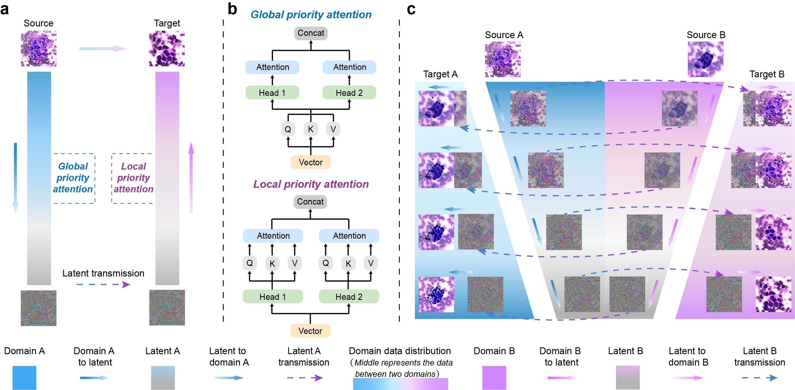

# ADBD

**Overcoming Pathology Image Data Deficiency: Generating Images from Pathological Transformation Process** 
[Zeyu Liu](https://github.com/Rowerliu), Yufang He, Yu Zhao, Yunlu Feng, Guanglei Zhang 
[Arxiv](https://arxiv.org/abs/2311.12316), [GitHub](https://github.com/suxuann/ddib)

## Overview
Histopathology serves as the gold standard for medical diagnosis but faces application limitations 
due to the shortage of medical resources. Leveraging deep learning, computer-aided diagnosis 
has the potential to alleviate the pathologist scarcity and provide timely clinical analysis. 
However, developing a reliable model generally necessitates substantial data for training, 
which is challenging in pathological field. In response, we propose an adaptive depth-controlled 
bidirectional diffusion (ADBD) network for image data generation. The domain migration approach 
can work with small trainset and overcome the diffusion overfitting by source information guidance. 
Specifically, we developed a hybrid attention strategy to blend global and local attention priorities, 
which guides the bidirectional diffusion and ensures the migration success. In addition, we developed 
the adaptive depth-controlled strategy to simulate physiological transformations, capable of 
yielding unlimited cross-domain intermediate images with corresponding soft labels. ADBD is effective 
for overcoming pathological image data deficiency and supportable for further pathology-related research.

## Usage

### Generating a sequence of intermediate images between source domain and target domain
1. Train a diffusion model on your data based on the [guided-diffusion](https://github.com/openai/guided-diffusion) 
2. Assign the path of trained models, and then generate intermediate images
(The total diffusion process includes 1000 steps, and we can get 10 intermediate images) 
`python scripts/frequency_generating_m_samples.py --diffusion_steps=1000 --amount=10`

## Acknowledgements
This implementation is based on / inspired by: 
[openai/guided-diffusion](https://github.com/openai/guided-diffusion) 
[openai/improved-diffusion](https://github.com/openai/improved-diffusion) 
[suxuann/ddib](https://github.com/suxuann/ddib)