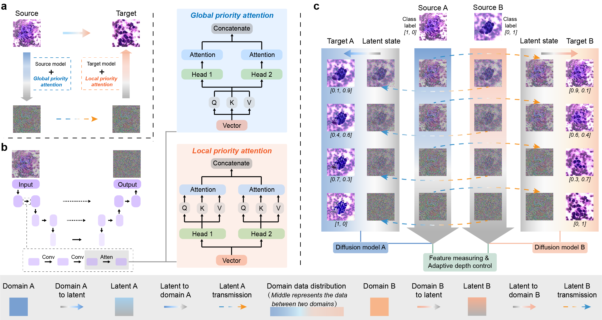

# ADD

**Generating Progressive Images from Pathological Transitions via Diffusion Model**<br/>
[Zeyu Liu](https://github.com/Rowerliu), [Tianyi Zhang](https://github.com/sagizty), Yufang He, Yu Zhao, Yunlu Feng, Guanglei Zhang<br/>
[Arxiv](https://arxiv.org/abs/2311.12316), [GitHub](https://github.com/Rowerliu/ADD)



## 🗃️ Overview
Pathological image analysis is a crucial field in deep learning applications. However, training effective models demands
large-scale annotated data, which faces challenges due to sampling and annotation scarcity. The rapid developing generative 
models show potential to generate more training sam-ples in recent studies. However, they also struggle with generalization 
diver-sity when limited training data is available, making them incapable of gener-ating effective samples. Inspired by 
pathological transitions between differ-ent stages, we propose an adaptive depth-controlled diffusion (ADD) net-work for 
effective data augmentation. This novel approach is rooted in do-main migration, where a hybrid attention strategy blends 
local and global at-tention priorities. With feature measuring, the adaptive depth-controlled strategy guides the bidirectional 
diffusion. It simulates pathological feature transition and maintains locational similarity. Based on a tiny training set 
(samples ≤ 500), ADD yields cross-domain progressive images with corre-sponding soft labels. Experiments on two datasets 
suggest significant im-provements in generation diversity, and the effectiveness of the generated progressive samples is 
highlighted in downstream classification tasks.

## 🗃️ Usage

### Generating a sequence of intermediate images between source domain and target domain
1. Train a diffusion model on your data based on the [guided-diffusion](https://github.com/openai/guided-diffusion)<br/>
2. Assign the path of trained models, and then generate intermediate images
(The total diffusion process includes 1000 steps, and we can get 10 intermediate images)<br/>
```bash
python scripts/frequency_generating_m_samples.py --diffusion_steps=1000 --amount=10
```

## 🗃️ Acknowledgements
This implementation is based on / inspired by:<br/>
[openai/guided-diffusion](https://github.com/openai/guided-diffusion)<br/>
[openai/improved-diffusion](https://github.com/openai/improved-diffusion)<br/>
[suxuann/ddib](https://github.com/suxuann/ddib)

## 🗃️ Enviroments
Same as IDDPM / ADM / DDIB

## 🗃️ Materials
The comparison methods are listed here:


| Model  | Based method | Paper                                                                                                          | Code                                                         |
|:-------|:-------------|:---------------------------------------------------------------------------------------------------------------|:-------------------------------------------------------------|
| ProGAN | GAN          | [Progressive Growing of GANs for Improved Quality, Stability, and Variation](https://arxiv.org/abs/1710.10196) | [Github](https://github.com/sidward14/gan-lab)                 |
| IDDPM  | Diffusion    | [Improved Denoising Diffusion Probabilistic Models](https://arxiv.org/abs/2102.09672)                          | [Github](https://github.com/openai/improved-diffusion)       |
| LoFGAN | GAN          | [LoFGAN: Fusing Local Representations for Few-shot Image Generation](https://openaccess.thecvf.com/content/ICCV2021/papers/Gu_LoFGAN_Fusing_Local_Representations_for_Few-Shot_Image_Generation_ICCV_2021_paper.pdf)         | [Github](https://github.com/edward3862/LoFGAN-pytorch)       |
| MixDL  | GAN          | [Towards Expert-Level Medical Question Answering with Large Language Models](https://arxiv.org/abs/2111.11672) | [Github](https://github.com/reyllama/mixdl)                  |
